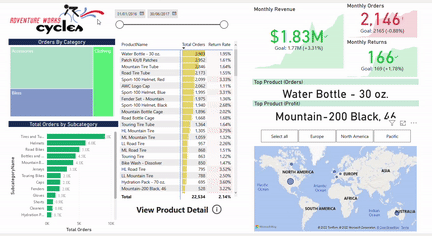
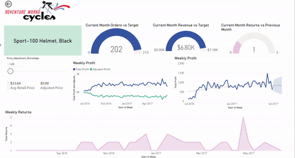
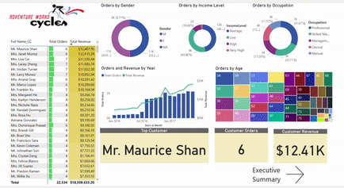
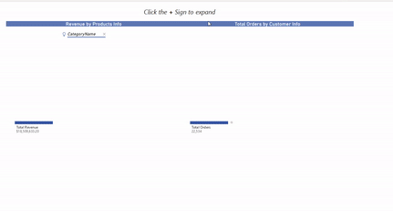
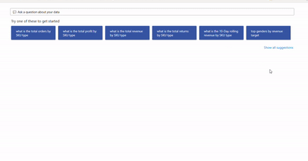

# Python_Machine_Learning_Goodreads

## Overview
The objective is to create an interactive and informative dashboard using Power BI.

## Data Used and Transformed
 The data will be taken from 8 different excel workbooks then transformed and cleaned in Power Query. 

 A model will be created to best segregate the data and allow for interaction.
 
 Some tables will be modified using DAX, for example extracting the days of the week in numerical form to a new column for better grouping <em><strong>(Day Of Week = WEEKDAY(AW_Calendar_Lookup[Date],2))</strong></em>. 
 
 Measures will be made to better interact and visualise the data, such as creating a 90 day rolling proft measure which interacts with the dates slider <em><strong>(10-Day Rolling Revenue = CALCULATE([Total Revenue], DATESINPERIOD(AW_Calendar_Lookup[Date], MAX(AW_Calendar_Lookup[Date]),-10,DAY)))</strong></em>
***

## Used
* Power BI
* Power Query
* Excel Workbook
* Data Analysis Expression (DAX)
***

## Power BI Report
The report in pbix format is here -> [Power_Bi_Dashboard](https://github.com/Cassidyd90/Power_Bi_Dashboard/tree/main/Dashboard%20File "Power_Bi_Dashboard").

The report is also available as in pdf here -> [Power_Bi_Dashboard_pdf](https://github.com/Cassidyd90/Power_Bi_Dashboard/tree/main/Dashbboard%20Pdf "Power_Bi_Dashboard_pdf")

Following are some examples of the report/dashboard in action:

***
## Acknowledgments
This project was part of a Microsoft Power BI for Business Intelligence course with Maven Analytics.
* [Maven Analytics](https://www.mavenanalytics.io/ "Maven Analytics")
***
## Contact
LinkedIn - https://www.linkedin.com/in/cassidyd90/	 
***
## License
Distributed under the GPL license. See LICENSE.txt for more information